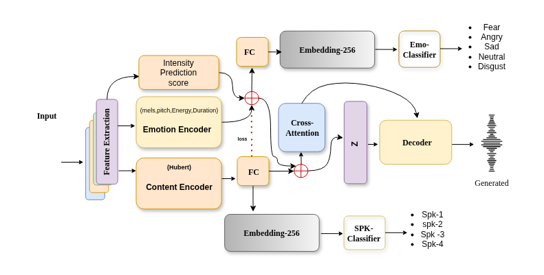
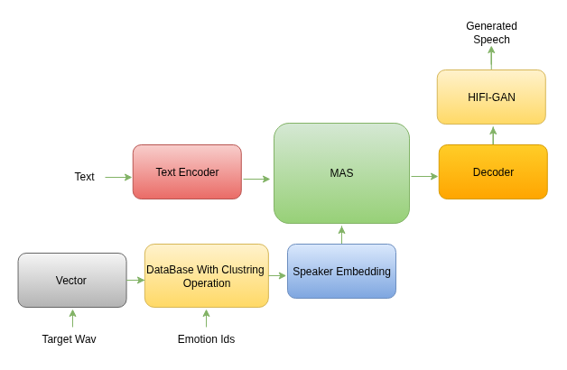
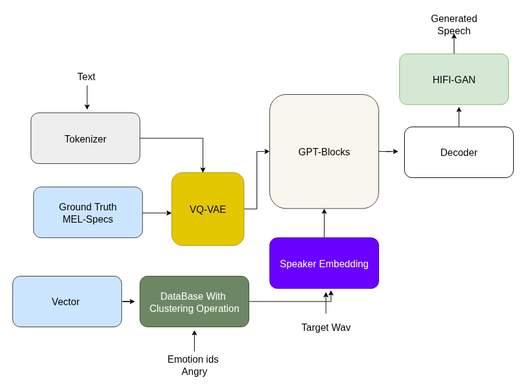
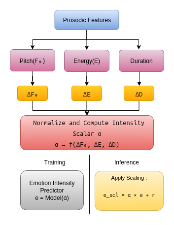
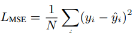
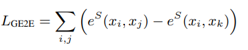
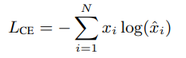
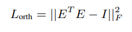
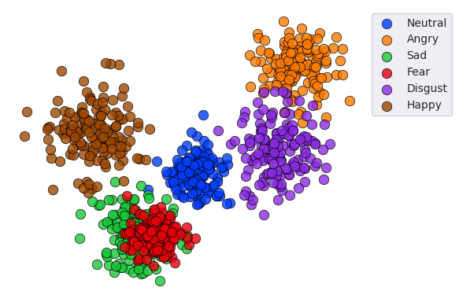

# EMOD: AN EFFICIENT APPROACH FOR LOW RESOURCE CONTROLLABLE EMOTIONAL SPEECH SYNTHESIS 🎤✨

## Overview
EMOD is a framework for enhancing expressive speech synthesis by capturing deep emotional embeddings from multilingual audio data. These embeddings integrate with end-to-end Text-to-Speech (TTS) models such as VITS and GPT-based speech models, enabling natural and controllable synthesis in low-resource language settings.

The extracted embeddings capture distinct emotions including happiness, sadness, anger, fear, surprise, and disgust, improving naturalness and human-likeness in generated speech. EMOD introduces fine-grained controllability, where deviations in pitch, energy, and duration are normalized into a continuous control factor. This parameter allows dynamic adjustment of emotional intensity, ranging from subtle expressivity to strong exaggeration.

### 🚀 **DEMO:** [Emotion-TTS Web](https://nn-project-2.github.io/Emotion-TTS-web/)
### 🎵 **Embeddings:** [Download Emotion embeddings.tar.xz](https://github.com/NN-Project-2/Emotion-TTS-Emebddings/blob/main/Emotion%20embeddings.tar.xz)

## 1. Table of Contents
1. [Introduction](#2-introduction)
2. [Emotional Embedding Database](#3-emotional-embedding-database)
3. [Integration with End-to-End TTS](#4-integration-with-e2e-tts)
4. [ Unsupervised Emotional Intensity Control](#5-how-the-intensity-unsupervised-was-trained-and-tuned)
5. [Emotional Speech Synthesis Model - Loss Functions](#6-emotional-speech-synthesis-model---loss-functions)
    1. [Mean Squared Error (MSE) Loss](#61-mean-squared-error-mse-loss-l_mse)
    2. [Generalized End-to-End (GE2E) Loss](#62-generalized-end-to-end-ge2e-loss-l_ge2e)
    3. [Cross-Entropy (CE) Loss](#63-cross-entropy-ce-loss-l_ce)
    4. [Orthogonality Loss](#64-orthogonality-loss-l_orth)
6. [Clustering for Emotion Cloning and Distance-Based Similarity](#7-clustering-for-emotion-cloning-and-distance-based-similarity)

  

## 2. Introduction
The objective of EMOD is to develop an efficient **emotional embedding extractor** capable of capturing deep emotional features from **multilingual audio datasets** and integrating them with **TTS models**. It synthesizes speech conveying distinct emotions while preserving speaker identity.

The embeddings are **language-independent**, allowing transfer of emotional tones to new speakers in low-resource languages. EMOD handles diverse datasets, ensuring **consistent and expressive speech synthesis** across languages and speakers.

## 3. Emotional Embedding Database  

We curated a **multilingual audio database** with diverse emotions and speaker variations to train our emotion embedding extractor. This ensures **robust embeddings** capable of zero-shot generalization and fine-grained emotion control.  

### Key Highlights  

- Languages: Tamil, Malayalam, Hindi, English, Kannada, Telugu, with extra data from Assamese, Marathi, and Punjabi.  
- Emotions: Neutral, Angry, Sad, Happy, Fear, Surprise, Disgust.  
- Audio: 16 kHz `.wav` format, Mel spectrograms.  
- Speakers: Diverse male and female voices across ages.  
- Duration: ~10–20 hours per language.  
- Annotations: Emotion, speaker, language, intensity.  

Full dataset details are available [here](https://github.com/NN-Project-2/Emotion-TTS-Emebddings/blob/main/README_1.md)

## 4. Integration with End-to-End TTS

The extracted **emotion embeddings** are integrated into both **VITS** and **GPT-based TTS** architectures to enable controllable emotional speech synthesis while preserving linguistic content and speaker identity. The **Emotion Encoder** processes acoustic attributes including fundamental frequency ($F_0$), energy, duration, and timbre to generate a continuous emotion embedding $z_{emo}$. This embedding is explicitly disentangled from content and speaker representations and projected into a shared latent space compatible with downstream TTS models. Emotional intensity is controlled using a **global scalar $\alpha$**, which acts as a multiplicative factor over the embedding vector:

$$
\tilde{z}_{emo} = \alpha \cdot z_{emo}
$$

Here, $\alpha$ is a **continuous real-valued parameter** representing the overall magnitude of emotional deviation from a speaker's neutral baseline. Increasing $\alpha$ amplifies all emotion-related features encoded in the latent space, including pitch variance, energy dynamics, and spectral timbre, without changing the direction of $z_{emo}$, which preserves the emotional type (e.g., happy, sad, angry). This design enables **continuous and monotonic control** of emotional strength, which is crucial for zero-shot, cross-lingual, and low-resource TTS scenarios where discrete intensity labels are unavailable.

To achieve **fine-grained control**, a dimension-wise modulation vector $\mathbf{r}$ is applied alongside $\alpha$:

$$
\tilde{z}_{emo} = \alpha \cdot (\mathbf{r} \odot z_{emo})
$$

Here, $\mathbf{r}$ selectively scales subspaces of the embedding corresponding to specific acoustic cues such as $F_0$, energy, or spectral envelope, allowing independent modulation of pitch, loudness, and timbre. This combination of $\alpha$ and $\mathbf{r}$ ensures both **global emotional intensity control** and **local, feature-specific adjustments**, giving highly flexible control over synthesized speech expressivity.

---

## 4.1 VITS Architecture

In the **VITS architecture**, the scaled emotion embedding $\tilde{z}_{emo}$ conditions the flow-based prior and decoder while remaining disentangled from the **Content Encoder**, which extracts speaker- and prosody-invariant linguistic features. The **variance adaptor** normalizes $F_0$, energy, and duration relative to speaker-specific baselines, allowing $\alpha$ to directly modulate **deviations from neutral prosody** rather than absolute acoustic values. During training, the Emotion Encoder is frozen, and VITS components learn to reconstruct mel-spectrograms conditioned on $\tilde{z}_{emo}$, enabling precise and stable emotion control. 

The effect of $\alpha$ is validated by performing **controlled inference experiments**, where $\alpha$ is varied while keeping content, speaker embedding, and random seed fixed. Objective evaluation measures monotonic changes in $F_0$ variance, energy range, and duration spread, confirming that $\alpha$ consistently amplifies expressivity without distorting content or speaker identity. Subjective evaluation is conducted using **Mean Opinion Score (MOS)** tests, where listeners rate emotional intensity and naturalness across different $\alpha$ values. Results show a perceptually linear and stable increase in emotional strength as $\alpha$ increases, with no artifacts or speaker leakage, confirming that $\alpha$ functions as a **reliable and interpretable control parameter** for VITS-based TTS.

  

---

## 4.2 GPT-Based TTS Architecture

In the **GPT-based TTS pipeline**, input text is tokenized using a **BPE tokenizer** and embedded into subword representations, which are processed by **GPT-style Transformer decoder blocks** trained to predict discrete acoustic tokens derived from a **VQ-VAE encoder**. The pre-computed emotion embeddings $z_{emo}$ are projected into the Transformer hidden dimension and injected using **concatenation and FiLM-based conditioning**. The scaled embedding $\tilde{z}_{emo} = \alpha \cdot (\mathbf{r} \odot z_{emo})$ is applied uniformly across all Transformer layers, enabling continuous modulation of expressivity during autoregressive token generation while preserving temporal coherence and speaker identity. $\alpha$ controls the **global emotional magnitude**, while $\mathbf{r}$ fine-tunes individual feature dimensions, allowing independent adjustment of pitch, energy, or timbre dynamics. Evaluation follows a similar methodology as in VITS: objective metrics track changes in prosodic statistics and speaker similarity, and subjective MOS tests quantify perceived emotional intensity and naturalness. Results confirm that $\alpha$ functions as a **stable, interpretable, and monotonic control parameter**, providing continuous, zero-shot, and cross-lingual controllable emotion synthesis in GPT-based TTS systems.

  

## 5. Unsupervised Emotional Intensity Control

  

In our framework, emotional intensity was trained in an unsupervised manner by modeling deviations in prosodic cues relative to each speaker’s neutral baseline. Specifically, variations in pitch (∆F₀), energy (∆E), and duration (∆D) were extracted for every utterance and normalized to define a continuous intensity scalar α. During training, the Emotion Intensity Predictor learned to map these deviations into latent embeddings, enabling smooth control across weak to strong expressivity levels. At inference, α was directly applied to scale the emotional embedding globally, while a dimension-wise vector r adjusted fine-grained intensity per feature dimension. This design allowed natural tuning of emotional strength without requiring explicit intensity labels, supporting zero-shot transfer and controllable synthesis across multiple languages and speakers.

## 6. Emotional Speech Synthesis Model - Loss Functions
Our training process employs four key loss functions to optimize the emotional speech synthesis model effectively. These losses ensure accurate reconstruction, proper emotion classification, speaker discrimination, and disentanglement of speaker and emotion embeddings.

### 6.1. Mean Squared Error (MSE) Loss (L_MSE)
The Mean Squared Error (MSE) Loss is utilized to measure reconstruction accuracy. This loss function minimizes the difference between the original speech signal and its reconstructed version. By reducing reconstruction errors over samples, L_MSE ensures high-quality speech synthesis. The reconstructed spectrogram closely resembles the ground truth, maintaining intelligibility and expressiveness.

  

### 6.2. Generalized End-to-End (GE2E) Loss (L_GE2E)
The Generalized End-to-End (GE2E) Loss is crucial for preserving speaker identity. It maximizes intra-speaker similarity while minimizing inter-speaker similarity, thereby improving speaker discrimination. By clustering embeddings from the same speaker closer together and pushing different speaker embeddings apart, GE2E loss effectively maintains speaker individuality during emotion transfer, ensuring that the synthesized speech retains the original speaker's characteristics.

  

### 6.3. Cross-Entropy (CE) Loss (L_CE)
The Cross-Entropy (CE) Loss is applied to both the emotion classifier and the speaker classifier.
- For emotion classification, CE loss ensures that the extracted emotional features are accurately mapped to their corresponding emotion labels.
- In the speaker classification task, CE loss enforces correct speaker identity prediction. The adversarial training setup between emotion and speaker classifiers refines the model’s ability to distinguish between these aspects while improving robustness against unwanted biases.

  

### 6.4. Orthogonality Loss (L_orth)
The Orthogonality Loss is introduced to disentangle emotion and speaker embeddings effectively. This loss function enforces orthogonality between the emotion and speaker representation spaces, preventing unwanted correlations. By ensuring that the extracted features from the emotion encoder do not overlap with speaker identity features, L_orth enhances the transferability of emotional embeddings across different speakers, facilitating effective cross-lingual and cross-gender emotion transfer.

  

These four loss functions collectively optimize our model to achieve high-quality emotional speech synthesis while preserving speaker identity and ensuring accurate emotion representation. The integration of these loss mechanisms enables a robust zero-shot emotional TTS system adaptable to low-resource languages and diverse speaker conditions.

### Benefits:
- Prevents **speaker leakage** into the emotion embedding.
- Ensures that **emotion embedding** only captures emotional content.
- Guarantees better generalization in multi-speaker scenarios.

## 7. Clustering for Emotion Cloning and Distance-Based Similarity
To achieve high-fidelity emotion cloning, we utilize distance-based clustering to measure the similarity between emotional embeddings. We apply hierarchical clustering and K-means clustering on extracted emotion embeddings to group similar emotional states while preserving speaker identity. The similarity between a neutral speech sample and an emotional target is computed using cosine similarity and Euclidean distance in the embedding space. This ensures that cloned emotional speech retains the target emotion while maintaining the original speaker's characteristics. Additionally, a contrastive loss function is used to enhance intra-class clustering (same emotion) and increase inter-class separation (different emotions), further refining the accuracy of emotion cloning.

  

## 8. Results

### 8.1. Performance on Different Languages

The following table presents results across four languages, measuring similarity (**Sim.**) to reference emotional speech, classification accuracy (**Cls. Acc.**) of predicted emotions, and Mean Opinion Score (**MOS**) for naturalness.

| Language    | Emotion | Sim. (%) | Cls. Acc. (%) | MOS |
|------------|---------|----------|---------------|-----|
| English    | Angry   | 89       | 85            | 3.81 |
| Hindi      | Sad     | 76       | 81            | 3.72 |
| Malayalam  | Happy   | 79       | 83            | 3.61 |
| Tamil      | Angry   | 83       | 79            | 3.75 |

---

### 8.2. Emotion Transfer Performance

This table shows Mean Opinion Score (**MOS**) results for speaker cloning quality and emotion transfer quality across different target speakers and emotions.

| Target Speaker        | Emotion  | MOS (Cloning) | MOS (Emotion) |
|----------------------|----------|---------------|---------------|
| English Female       | Angry    | 3.61          | 3.63 |
| English Male         | Disgust  | 3.78          | 3.75 |
| Hindi Male           | Sad      | 3.56          | 3.54 |
| Hindi Female         | Fear     | 3.87          | 3.77 |
| Tamil Female         | Angry    | 3.76          | 3.69 |
| Tamil Male           | Angry    | 3.49          | 3.56 |
| Malayalam Male       | Happy    | 3.77          | 3.68 |
| Malayalam Female     | Happy    | 3.68          | 3.52 |

## 9. Zero-Shot Emotion Transfer and Control Scenarios in TTS  

- ✅ Emotion TTS  
- ✅ Cross-Lingual Transfer  
- ✅ Cross-Gender Emotion Transfer  
- ✅ Emotion Intensity Control  
- ✅ Integration with End-to-End TTS  

For more details, refer to the documentation. 🚀
