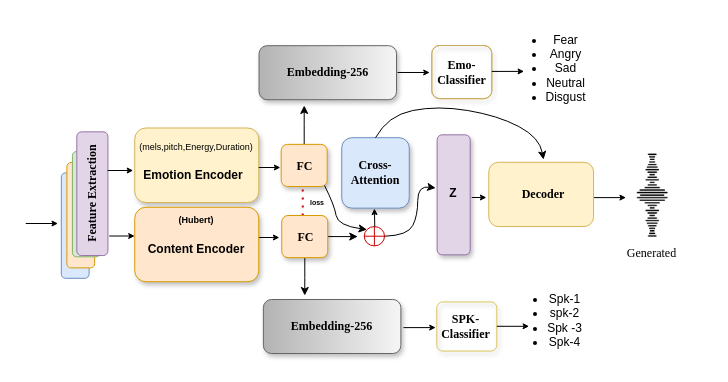
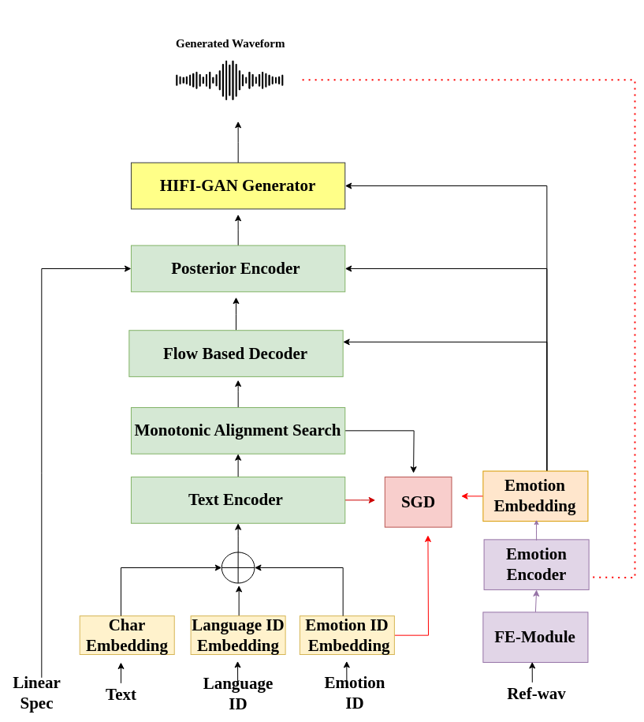

# EMOD: An Efficient Approach for Low-Resource Emotional Speech Synthesis 🎤✨

## Overview
**EMOD** is a robust framework designed to enhance **expressive speech synthesis** by capturing **deep emotional embeddings** from multilingual audio data. This project aims to develop emotion embeddings that can be integrated with **end-to-end Text-to-Speech (TTS)** models like VITS, allowing natural and expressive speech synthesis even in **low-resource language settings**.

Our approach ensures that the extracted emotion embeddings effectively capture **distinct emotional characteristics** such as happiness, sadness, anger, and disgust, making synthesized speech sound more natural and human-like.

### 🚀 **DEMO:** [Emotion-TTS Web](https://nn-project-2.github.io/Emotion-TTS-web/)
### 🎵 **Embeddings:** [Download Emotion embeddings.tar.xz](https://github.com/NN-Project-2/Emotion-TTS-Emebddings/blob/main/Emotion%20embeddings.tar.xz)

## 📚 Table of Contents
- [Introduction](#introduction)
- [Emotional Embedding Database](#emotional-embedding-database)
- [Integration with E2E TTS](#integration-with-e2e-tts)
- [Loss Functions](#loss-functions)
- [Orthogonality Loss for Embedding Separation](#orthogonality-loss-for-embedding-separation)
- [Zero-Shot Emotion Cloning with VITS](#zero-shot-emotion-cloning-with-vits)
- [Experimental Results](#experimental-results)
- [Conclusion](#conclusion)

  

## 📖 Introduction
The objective of this project is to develop a highly efficient **emotional embedding extractor** that captures deep emotional features from **multilingual audio datasets** and integrates them with **TTS models**. Our model can synthesize speech that conveys distinct emotions without compromising speaker identity.

The extracted emotion embeddings are language-independent and can transfer emotional tones to new speakers, even in low-resource language settings. We designed this model to handle diverse datasets, ensuring **consistent and expressive speech synthesis** across various languages and speakers.

### 💪 Supported Emotions
The embeddings capture the following emotions:
- 😠 **Anger**
- 😢 **Sadness**
- 😐 **Neutral**
- 😊 **Happiness**
- 😱 **Fear**
- 🤢 **Disgust**

## 📀 Emotional Embedding Database
To train our emotion embedding extractor, we curated a large-scale, multi-language audio database featuring diverse emotions and speaker variations. This database is essential for ensuring high-quality and robust embeddings.

### 📊 Key Database Highlights:
- **Languages:** Tamil, Malayalam, Hindi, English, Kannada, Telugu
- **Balanced Data:** ~30 minutes of audio per emotion, per language
- **Audio Quality:** Down-sampled to **16 kHz** and converted to **Mel spectrograms**
- **Speaker Diversity:** Male and female speakers from various cultural and language backgrounds

This diverse database enables the emotion embedding extractor to capture high-level emotional representations applicable across languages and speakers.

## 🔍 Integration with E2E TTS
We designed our framework to seamlessly integrate with **end-to-end TTS models (E2E-TTS)** like VITS. The **emotion embeddings** are extracted from audio files and then passed along with text and speaker embeddings to generate expressive speech.

### ✅ Steps for Integration:
1. **Extract Mel spectrograms** from input audio files.
2. **Extract emotion embeddings** using our pre-trained emotion embedding extractor.
3. **Feed text, speaker embeddings, and emotion embeddings** to the VITS model.
4. **Generate expressive speech** with controlled emotional tones.

This process enables the TTS model to generate speech that accurately reflects the target emotion and speaker identity.

# Emotional Speech Synthesis Model - Loss Functions

Our training process employs four key loss functions to optimize the emotional speech synthesis model effectively. These losses ensure accurate reconstruction, proper emotion classification, speaker discrimination, and disentanglement of speaker and emotion embeddings.

### 1. Mean Squared Error (MSE) Loss (L_MSE)
The Mean Squared Error (MSE) Loss is utilized to measure reconstruction accuracy. This loss function minimizes the difference between the original speech signal and its reconstructed version. By reducing reconstruction errors over samples, L_MSE ensures high-quality speech synthesis. The reconstructed spectrogram closely resembles the ground truth, maintaining intelligibility and expressiveness.

  

### 2. Generalized End-to-End (GE2E) Loss (L_GE2E)
The Generalized End-to-End (GE2E) Loss is crucial for preserving speaker identity. It maximizes intra-speaker similarity while minimizing inter-speaker similarity, thereby improving speaker discrimination. By clustering embeddings from the same speaker closer together and pushing different speaker embeddings apart, GE2E loss effectively maintains speaker individuality during emotion transfer, ensuring that the synthesized speech retains the original speaker's characteristics.

  

### 3. Cross-Entropy (CE) Loss (L_CE)
The Cross-Entropy (CE) Loss is applied to both the emotion classifier and the speaker classifier.
- For emotion classification, CE loss ensures that the extracted emotional features are accurately mapped to their corresponding emotion labels.
- In the speaker classification task, CE loss enforces correct speaker identity prediction. The adversarial training setup between emotion and speaker classifiers refines the model’s ability to distinguish between these aspects while improving robustness against unwanted biases.

  

### 4. Orthogonality Loss (L_orth)
The Orthogonality Loss is introduced to disentangle emotion and speaker embeddings effectively. This loss function enforces orthogonality between the emotion and speaker representation spaces, preventing unwanted correlations. By ensuring that the extracted features from the emotion encoder do not overlap with speaker identity features, L_orth enhances the transferability of emotional embeddings across different speakers, facilitating effective cross-lingual and cross-gender emotion transfer.

  

These four loss functions collectively optimize our model to achieve high-quality emotional speech synthesis while preserving speaker identity and ensuring accurate emotion representation. The integration of these loss mechanisms enables a robust zero-shot emotional TTS system adaptable to low-resource languages and diverse speaker conditions.

### Benefits:
- Prevents **speaker leakage** into the emotion embedding.
- Ensures that **emotion embedding** only captures emotional content.
- Guarantees better generalization in multi-speaker scenarios.

### Clustering for Emotion Cloning and Distance-Based Similarity
To achieve high-fidelity emotion cloning, we utilize distance-based clustering to measure the similarity between emotional embeddings. We apply hierarchical clustering and K-means clustering on extracted emotion embeddings to group similar emotional states while preserving speaker identity. The similarity between a neutral speech sample and an emotional target is computed using cosine similarity and Euclidean distance in the embedding space. This ensures that cloned emotional speech retains the target emotion while maintaining the original speaker's characteristics. Additionally, a contrastive loss function is used to enhance intra-class clustering (same emotion) and increase inter-class separation (different emotions), further refining the accuracy of emotion cloning.

  

## 🎧 Zero-Shot Emotion Cloning with VITS
Our approach supports **zero-shot emotion cloning**, allowing the model to transfer emotions to a new speaker without training on their voice.

### ✅ Steps for Zero-Shot Cloning:
1. **Extract the speaker embedding** from target speaker audio.
2. **Extract the emotion embedding** from source emotion audio.
3. **Combine both embeddings** and pass to the VITS model.
4. **Generate expressive speech** that captures the target speaker’s voice and source emotion.

This zero-shot capability is crucial for **emotion conversion** across low-resource languages and speakers.

  

## 📊 Experimental Results
We evaluated the model's performance across multiple languages using standard metrics like similarity, accuracy, and MOS (Mean Opinion Score).

| Language    | Emotion   | Similarity (%) | Accuracy (%) | MOS Score |
|-------------|-----------|----------------|---------------|-----------|
| **English** | Angry     | 89%            | 85%           | 3.81      |
| **Hindi**   | Sad       | 76%            | 81%           | 3.72      |
| **Malayalam** | Happy   | 79%            | 83%           | 3.61      |
| **Tamil**    | Angry    | 83%            | 79%           | 3.75      |

## 🏆 Conclusion
Our work introduces an efficient approach for **emotion-aware speech synthesis** using deep emotion embeddings and orthogonal separation of speaker and emotion information. The model demonstrates superior **emotion transfer** across low-resource languages and speakers.

Moving forward, we aim to enhance our model by incorporating **self-supervised learning**, expanding **cross-lingual support**, and exploring more robust emotion representations.

✅ **EMOD is transforming low-resource emotional speech synthesis into reality!** 🚀

